# Gait Trajectory and Parameter Estimation
## By Mohammad Joshaghani


This project is a part of "Machine Learning in Time Series" course. The aim of the project is to train a CNN-Fully Connected based architecture on raw Accelerometer and Gyroscope data to estimate some stride parameters, and the trajectory. The parameters can be stride length, Sole Angle, Impact angle, and other parameters available on the dataset. 

**Models used**: In this work, a CNN fully connected architecture is used. The network consists of 3 sub-networks: a simple CNN network, a core network, and a regressor (fully connected) networks. so far, resnet18, resnet34, resnet50, resnet101 and a normal Identity networks are implemented as the core Network is used and their results are compared. For the CNN network, any size and any architecture, and Batch normalization and Layer Normalization are implemented and can be set from a .cfg file. The same applies to the last regressor network.


## Getting Started

To use the project, simply use the following command:

```git clone https://gitlab.com/moh.j/trajectory-estimation.git```


### Prerequisites

The code is written with Python 3.7. For better compatibility, It's better to use a python with a version higher or equal than 3.7.

### Installing

The conda .yml file contains required libraries for the project. To install it, simply run:

``` conda env create -f environment.yml ```


## Running the tests

To run the test, you only need to feed the config file ('cfg') to the program. In the Train.py file, simply add the name of the config file in the cfg_file_names variable, and feed the whole directory to the Train onject. The format of the config file will be explaied later.


## Outputs and project structure
After feeding each config file, depending on if the experiment is a trajectory estimation, or parameter estimation, the related experiment folder is created. Then, another subfolder is created within the related experiment with the name being the date and time of the experiment, so the experiments are easily distinguishable.

In each experiment directory, First, the Config file (which uniquely describes everything needed to know about the experiment), the bland-altman plot, Error and std plot, CNN Kernels and loss functions and res.txt and label distribution is available. Then, two other subfolders, namely outputs and models, exist. The output folder includes a set of validation samples with the outputs and what network has predicted through training. The models subfolder also includes the best intermediate models.

A summary of the project structure is as follows:
```
trajectory-estimation
│   Readme.md
│   environment.yml
│   Train.py (The main file to run the code with)
│
└───cfg (the configuration folders)
│       I.cfg
│   
└───data (the dataset folder)
|   │   
|   └─── Vicon_running_data_set   
|
└───Lib
|   │   
|   └─── python tools to visualize the code and build the model
|
└───Models
|   │   
|   └─── models.py
|
└───parameter_experiments
    │   
    └───(experiment date and time)
        |   dataset_distribution.png
        |   test_data.png
        |   train_data.png
        |   bland_altman.png
        |   I.cfg
        |   Error_and_std_plot.png
        |   loss.png
        |   res.txt       
        |   Kernel_i.png
        |
        └───outputs
        |     predictions_epoch_i.png
        |
        └───models
               model_epoch_i.pwf


```


### Detailed Explanation

This section includes more detailed explanation about important parts of the project.


## Outputs
Here some outputs of trajectory and parameter estimation tasks are available.


<br>


**Predictions outputs for Parameter Estimation task**
This part includes the prediction of the network over the same set of inputs through training. some examples are brought here


Prediction Epoch 0, 70 and 125

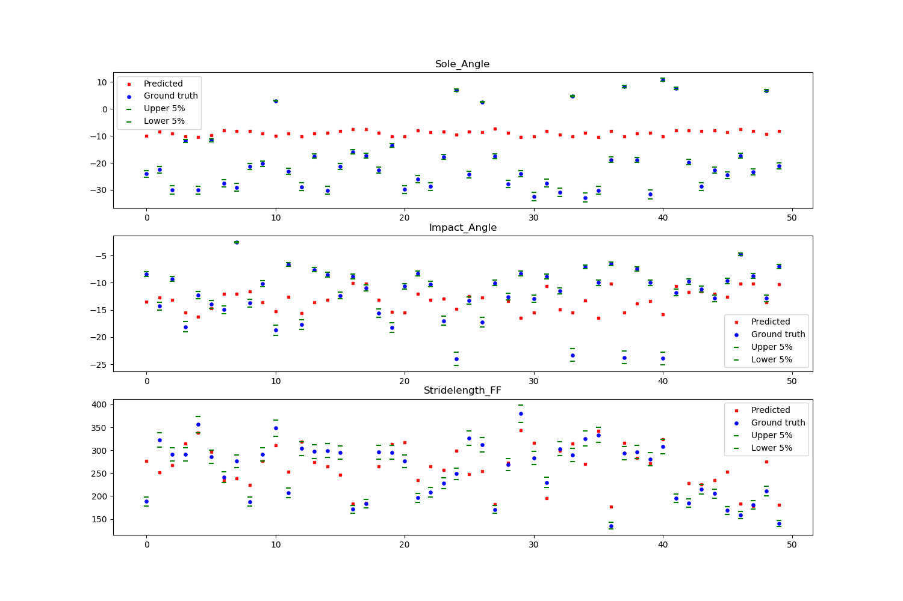  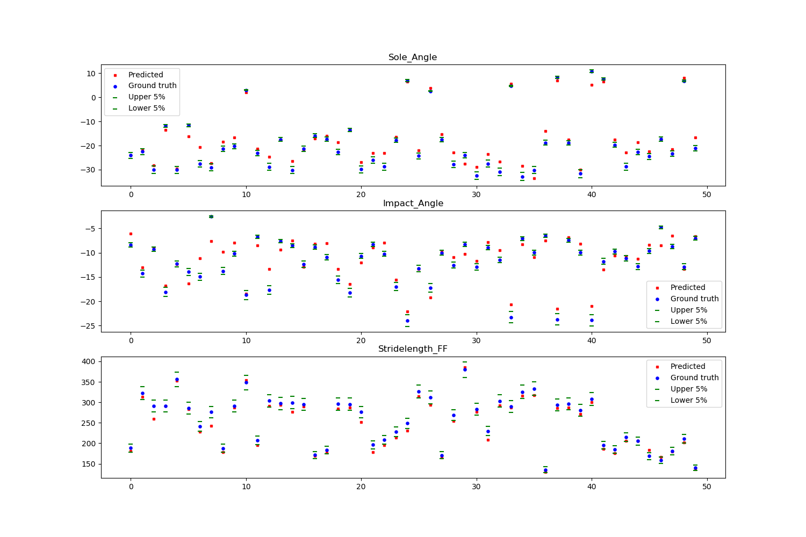
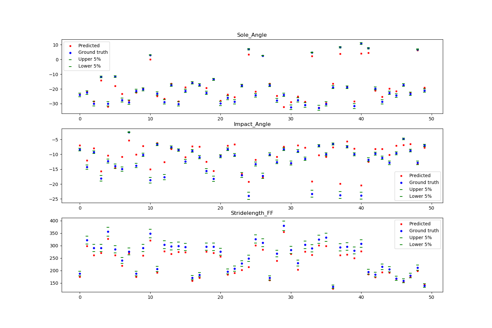


<br>

**Predictions outputs for Trajectory estimation task**
This part includes the prediction of the network over the same input through training. some examples are:

<br>

Prediction Epoch 0, 30 and 90

<br>
<br>


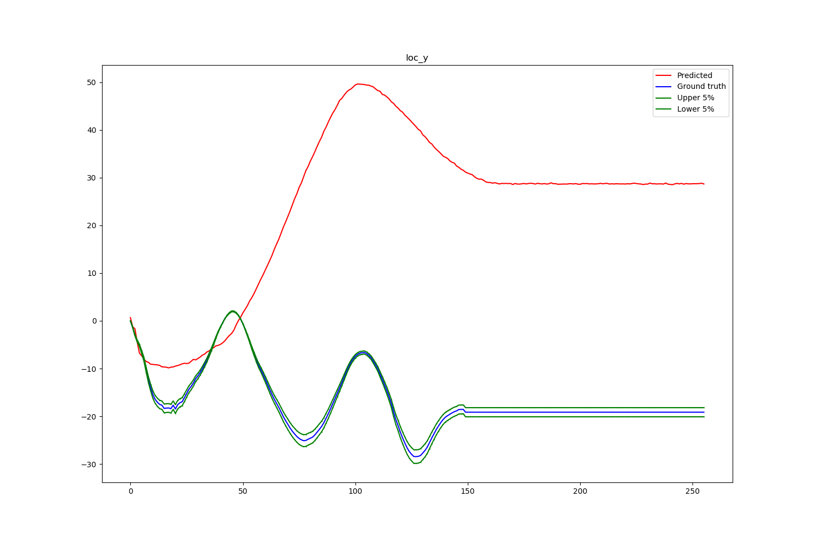

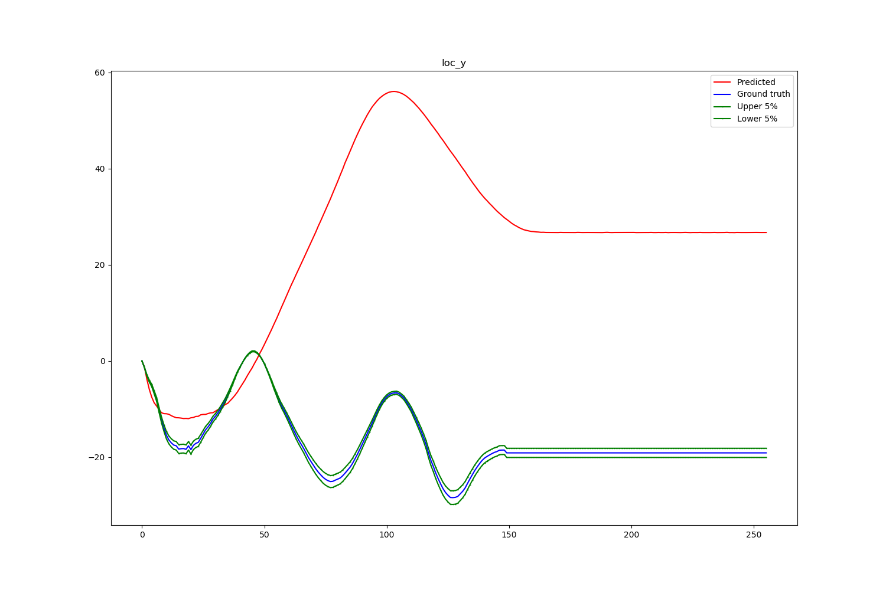

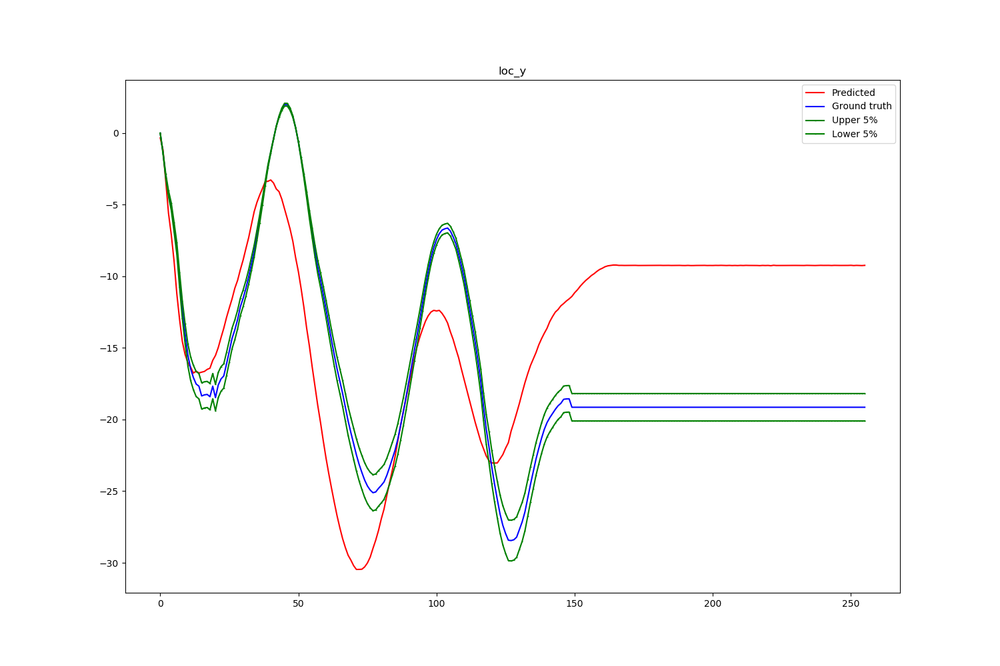


<br>

<br>

<br>

**res.txt**
Complete analysis of Network performance after each validation epoch. It includes test and train loss values, MAE (mean Absolute Error) and standard deviation of predictions. It includes all information required to analyse the Network performance. The format is as follows:

```
Epoch:0, mse_tr=22.79364, mse_te=39.69819, std_te=12.96422, mae_Sole_Angle=18.37111, mae_Impact_Angle=2.96926, mae_Stridelength_FF=32.01392, 
Epoch:5, mse_tr=14.79226, mse_te=30.15382, std_te=10.98177, mae_Sole_Angle=7.66153, mae_Impact_Angle=3.03392, mae_Stridelength_FF=27.87448, 
Epoch:10, mse_tr=12.00280, mse_te=32.09567, std_te=7.49678, mae_Sole_Angle=5.60194, mae_Impact_Angle=3.97643, mae_Stridelength_FF=30.64894, 
Epoch:15, mse_tr=9.88578, mse_te=18.74840, std_te=6.04734, mae_Sole_Angle=7.46260, mae_Impact_Angle=5.27190, mae_Stridelength_FF=14.18528, 
Epoch:20, mse_tr=8.18998, mse_te=14.99865, std_te=5.05336, mae_Sole_Angle=3.94008, mae_Impact_Angle=2.29995, mae_Stridelength_FF=13.40927, 
Epoch:25, mse_tr=7.84687, mse_te=17.97716, std_te=5.87047, mae_Sole_Angle=8.67680, mae_Impact_Angle=2.60017, mae_Stridelength_FF=13.96408, 
Epoch:30, mse_tr=7.25536, mse_te=15.64668, std_te=5.03875, mae_Sole_Angle=3.20657, mae_Impact_Angle=6.06750, mae_Stridelength_FF=13.03788, 
Epoch:35, mse_tr=6.86404, mse_te=23.18549, std_te=8.66590, mae_Sole_Angle=5.41939, mae_Impact_Angle=2.51346, mae_Stridelength_FF=21.70725, 

```


<br>

**Bland-Altman Plot** :
For multiple or single bland-altman plot, here is the following output:

<center> Bland-Altman plot </center>


<br>

**Data Split distribution** :
Three plots for this purpose, one the distribution of the labels, and the other one selected subjects with trials available.


<center> dataset split label distribution </center>
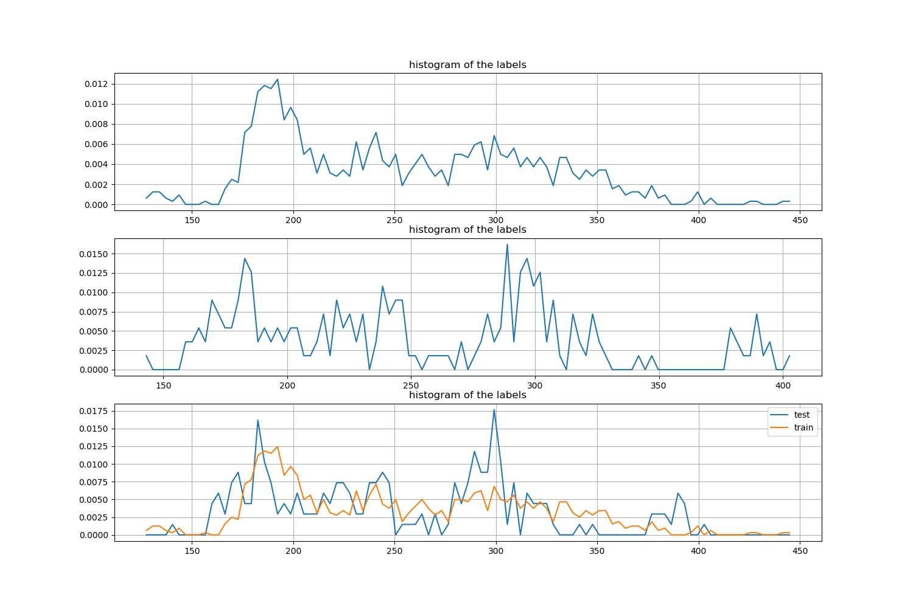

 Test data subjects and the number of data            |  Train data subjects and the number of data  
:-------------------------:|:-------------------------:
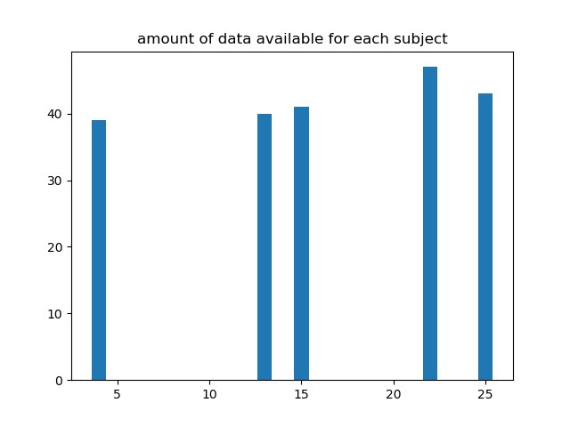  | 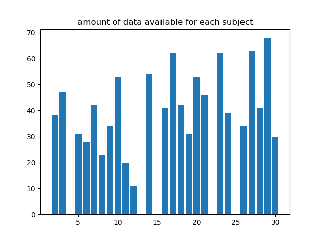


<center> *Error and std plot per iteration* </center>
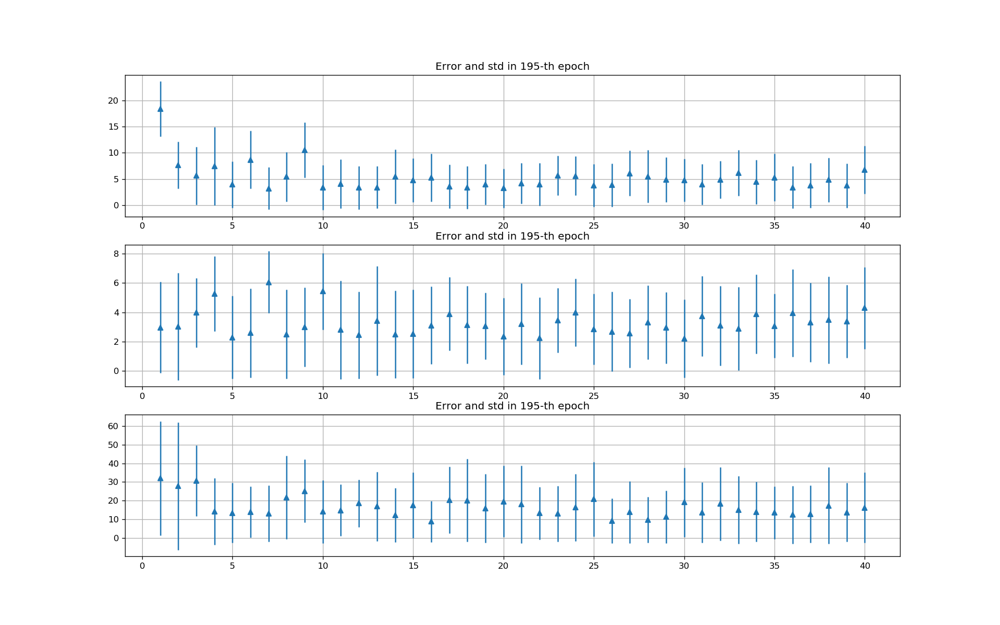

<br>


**CNN Kernels:**
This part plots the kernels of the first subnetwork, the CNN network. for example, in a 2 layer CNN network:  </br>


<left> Kernel 0 </left>  | <center> Kernel 1 </center>
 :-------------------------:|:-------------------------:
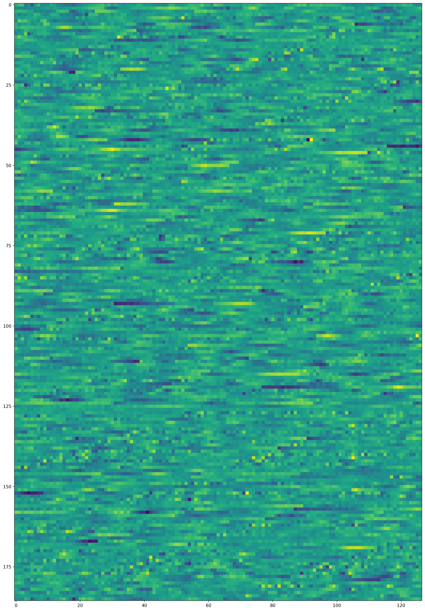  :|:  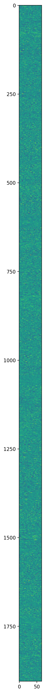


<br>

**Loss plot**
Train and Validation loss is also plotted as following:


<center> Train and Validation loss </center>
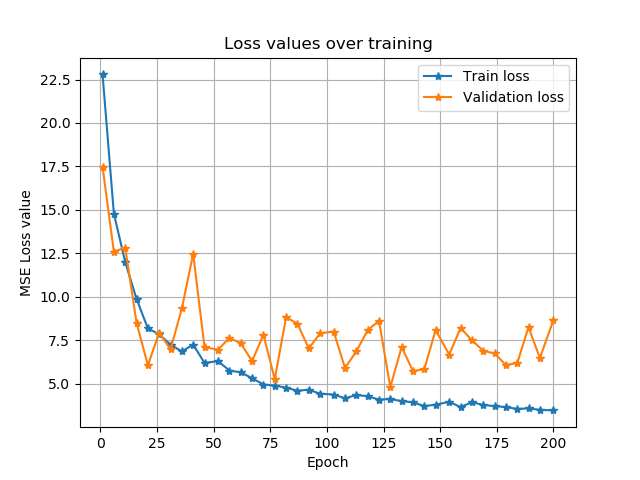

<br>


<br/>


### Dataset

The dataset used to train and validate the network is a private dataset called *Vicon running dataset*. It contains the data from the study conducted with Martin Ullrich and Pascal Zobel. To access the dataset, please contact.


### Trajectory Estimation and Gait Parameter Estimation

The data gathered Accelerometers is not Ideal and suffers from noise. The Gyroscope data is also not suitable to be used in a standalone fashion as it drifts away from the true value. The Accelerometer and Gyroscope data should be fused in a way that mitigates this problem and returns the desired values. For this purpose we used a CNN-DNN Network.

The Parameters to estimate is Stride length and Sole Angle and Impact Angle, and all other parameters available in the vicon_dataset.

Besides, the network can also predict the trajectory. However, a CNN Fully connected architecture is not suitable for such a task, and as a result, at each time, only one of the followings can be estimatied: loc_x, loc_y, loc_z, orientation_x, orientation_y, orientation_z.


### Model and Config File Format

To feed the structure of the network, a .cfg file is required. This file, includes all the parameters of the model and settings in the training. This file, alone, completely explains everything about the test. 

<br>


**[input]**

cw_len=256  *:length of the window over the data*

batch_size=4 *: batch size in training*


<br>


**[cnn]** (*this part includes the config for the CNN layers.*)

cnn_N_filt=32,64

cnn_len_filt=30,15

cnn_max_pool_len=2,2

cnn_use_laynorm_inp=False (* Note: you should either use layer norm or batch norm)

cnn_use_batchnorm_inp=False

cnn_use_laynorm=True,True

cnn_use_batchnorm=False,False

cnn_act=leaky_relu,leaky_relu

cnn_drop=0.0,0.0,0.0

cnn_freeze=False

pt=none *:pretrained model*

<br>

**[core_network]** (*This part includes the information of the core network*)

net_type=resnet101 *(from the set resnet18, resnet34, resnet50, resnet101, identity)*

<br>


**[regressor]** : (*The fully connected regressor network*)

fc_lay=16  

fc_drop=0.0

fc_use_laynorm_inp=False

fc_use_batchnorm_inp=False

fc_use_batchnorm=False

fc_use_laynorm=False

fc_act=leaky_relu

<br>


**[simulation]**

Augmentation=False

num_aug=3

estimate_trajectory=False

cost_function=MSELoss (from the set MSELOSS, SmoothL1Loss, L1Loss)

<br>
<br>


### Data Pre-processing and train-test data split

Due to the end-to-end nature of the task, no preprocessing is done on the data, except some minor changes to make sure the data is meaningful. One input data sample is as followed:

<br>

<center> One input sample </center>

<p align="center">

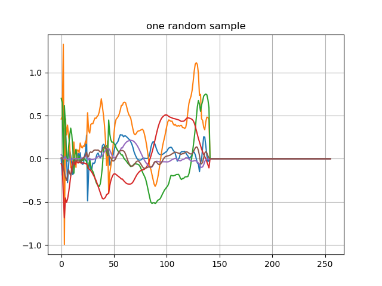

</p>

<br>

The following changes has been done to the data:

- The location data, which is the target value for the trajetory estimation task, are set to zero at the beginning of each stride.

- The sensor data is normalized. The Accelerometer data is divided by 12*g and gyroscope data is divided by 2000 (This information is provided by the dataset and is an standard approach to use the sensor data and normalize with respect to the sensor range).

The train-test split is performed based on subjects. The subjects in the test and train set do not overlap. The default validation size is 0.2 percent, and overall, there are 1020 training data and 183 test samples.

<br>


### Training

The configuration of the network is read from the .cfg file elaborated in the Model and Config File Format section. 
Adam with initial learning rate of 0.001 as well as the defined loss function is used to train the network. The network is trained for some defined maximum epochs (default 200), and the intermediate models are saved in the experiment/{run date}/model subdirectory.

<br>

### Evaluation
After *save_frequency* epochs of training, the model is evaluated and the results are saved in res.txt file, and the loss and accuracy is also plotted. The evaluation is done on subjects that has not been seen by the network.


<br>


### Future Work

In close future, the following tasks will be added to the repository:

 - RNN networks instead of the last layer fully connected
 - Trajectory estimation error and predict values will be updated
 - optimal architecture for parameter estimation and results

## Author
The project is done by [Mohammad Joshaghani](https://github.com/moh.j). 


## Acknowledgments
I would like to thank [Angel Villar Coralles](https://github.com/angelvillar96) as a friend helping out with programming problems.

